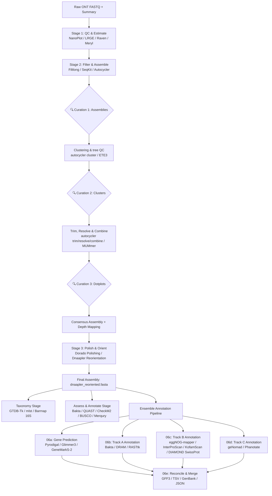

# ProkaryONT 🧬

ProkaryONT is a comprehensive, production-grade automated pipeline for **Oxford Nanopore Technologies (ONT)**-based prokaryotic genome assembly, polishing, taxonomic classification, quality assessment, and high-fidelity ensemble functional annotation.

It orchestrates industry-standard bioinformatics tools via a robust, subcommand-driven shell interface, allowing both rapid automated runs and hands-on, step-by-step manual curation.

---

## 🗺️ Pipeline Overview

The pipeline is split into three main execution phases: **Core Assembly & Polishing (Stages 1–3)**, **Primary Downstream Analysis (Taxonomy & Single-Tool Annotation)**, and an **Ensemble Annotation & Reconcilation Pipeline**.



---

## ✨ Key Features

- **Automated Genome Size Estimation**: Integrates weighted estimates from `LRGE` (k-mer-based) and a fast `Raven` draft assembly (`(2*Raven + LRGE) / 3`) to configure downstream subsampling.
- **Robust Subsample Assemblies**: Subsamples input reads and runs up to 10 assemblers in parallel (including `Flye`, `Canu`, `Hifiasm`, `Raven`, `Miniasm`, `MetaMDBG`, `Myloasm`, `Plassembler`, `NextDenovo`, and `Wtdbg2`) using GNU `Parallel`.
- **ETE3-Based Tree Checks**: Evaluates the clustering tree dynamically to flag clades showing branch lengths exceeding $5\times$ the median or single-assembler dominance.
- **Automated Plot Generation**: Distributes pairwise alignments using `Autocycler dotplot` for small replicons (plasmids) and `MUMmer` (nucmer + mummerplot) for chromosome-scale sequences to review overlap trimming.
- **Real-Time Read-Depth Tracking**: Maps filtered reads back to consensus using `minimap2` and `samtools` to generate coverage metrics and flag high-copy-number replicons (depth $> 1.5\times$ relative to the chromosome).
- **Dorado-Based Polishing**: Checks for moves tables (`mv:B:c` tags) in BAM files and prompts for read group resolution (unification, selection, or ignoring) in multi-read-group runs.
- **Smart Reorientation**: Utilizes `Dnaapler` to locate start genes (e.g., `dnaA` for chromosomes, `repA` for plasmids, `terL` for phages) and rotate contigs to a standardized biological origin.
- **Ensemble Annotation Engine**:
  - **Genomic Predictions**: Merges predictions from `Pyrodigal`, `Glimmer3`, and `GeneMarkS-2` using a consensus algorithm with a Pyrodigal tiebreaker.
  - **Assembly Features (Track A)**: Coordinates structural annotation via `Bakta`, `DRAM`, and imported BV-BRC `RASTtk` records.
  - **Homology Databases (Track B)**: Consolidates predictions from `eggNOG-mapper`, `InterProScan`, `KofamScan`, and `DIAMOND SwissProt`.
  - **Prophage Discovery (Track C)**: Extracts prophage intervals using `geNomad` and annotates phage-specific ORFs with `Phanotate`.
  - **Consensus Reconciliation**: Merges all annotation data into a single `GFF3`, `TSV` annotation matrix, fully annotated `GenBank` flatfile, and an isolate summary `JSON`.

---

## 🛠️ Installation & Dependencies

To run the pipeline, ensure the following tools are available in your `$PATH`:

### Phase 1: Assembly & Polishing
- **Filtering & QC**: `filtlong`, `seqkit`, `NanoPlot`
- **Draft Estimation**: `lrge`, `raven`
- **Subsampling & Assembly**: `autocycler` (v0.1.0+), `meryl`, `samtools`, GNU `parallel`, and desired assemblers (`flye`, `canu`, `hifiasm`, `metaMDBG`, `miniasm`, `minipolish`, `minimap2`, `plassembler`, etc.)
- **Tree Analysis**: Python 3 with `ete3` library (optional)
- **Dotplots**: `mummer` (specifically `nucmer`, `mummerplot`)
- **Polishing & Reorientation**: `dorado`, `dnaapler`

### Phase 2: Downstream & Annotation
- **Taxonomy**: `gtdbtk` (requires GTDB reference DB), `mlst`, `barrnap`
- **Assessment**: `quast`, `checkm2`, `busco` (with lineages), `merqury` (requires `merqury.sh`)
- **Gene Finding**: `pyrodigal`, `glimmer3`
- **Ensemble Annotation**: `bakta` (requires database), `DRAM.py`, `emapper.py` (eggNOG-mapper), `interproscan.sh`, `exec_annotation` (KofamScan), `diamond`, `genomad` (requires database), `phanotate.py`

---

## ⚙️ Configuration (`pipeline.conf`)

The configuration file `pipeline.conf` controls all paths, database locations, threads, and parameter thresholds. Key variables include:

```bash
# --- Required inputs ---
input_fastq=input.fastq.gz
sequencing_summary=sequencing_summary.txt
pod5_dir=pod5_dir/
sample_name=MyBacteria

# --- Compute & Filtering ---
threads=128
read_type=ont_r10
filtlong_min_length=200
filtlong_keep_percent=90

# --- Databases ---
gtdbtk_data_path=/path/to/gtdbtk_db
bakta_db=/path/to/bakta_db
genomad_db=/path/to/genomad_db
interproscan_db=/path/to/interproscan
kofam_profiles=/path/to/kofam/profiles
kofam_ko_list=/path/to/kofam/ko_list
```

---

## 🚀 Execution & Usage

The main interface to the pipeline is `prokaryont.sh`.

```bash
chmod +x prokaryont.sh
./prokaryont.sh --help
```

### 1. Full Automated Assembly (Stages 1–3)
Runs read QC, filtering, multi-assembler subsampling, clustering, consensus combination, dorado polishing, and dnaapler reorientation.
```bash
./prokaryont.sh assemble --config pipeline.conf
```

> [!NOTE]
> During assembly, the pipeline will pause at **Manual Curation Points** to allow file inspection (e.g., verifying draft assembly sizes, moving misclustered contigs, inspecting dotplots). You can bypass these pauses by passing the `--skip-curation` flag (or uncommenting `skip_curation=true` in the configuration).

### 2. Resuming Execution
If the pipeline halts during assembly or you wish to adjust parameters, you can resume from specific steps using:
```bash
./prokaryont.sh assemble --config pipeline.conf --resume-from [cluster|trim|dnaapler]
```
- `cluster`: Skips read filtering and assemblies, resumes from Autocycler clustering.
- `trim`: Skips assembly and clustering, resumes from Autocycler overlap trimming/resolving.
- `dnaapler`: Skips polishing, resumes from Dnaapler reorientation.

### 3. Taxonomic Classification
Executes GTDB-Tk classification, MLST typing, and Barrnap 16S rRNA gene extraction.
```bash
./prokaryont.sh taxonomy --config pipeline.conf
```
*Review the taxonomy outputs to update your organism details (genus, species, gram stain) in `pipeline.conf` prior to annotation.*

### 4. Primary Annotation & QA
Runs Bakta annotation and standard quality assessment metrics (QUAST, CheckM2, BUSCO, and Merqury).
```bash
./prokaryont.sh annotate --config pipeline.conf
```

### 5. Ensemble Annotation Pipeline
For high-fidelity structural and functional annotation, run the ensemble scripts sequentially:

```bash
# A. Predict consensus gene coordinates
bash 06a_predict_genes.sh --assembly dnaapler_reoriented.fasta --config pipeline.conf

# B. Run assembly-level annotations (Track A)
bash 06b_annotate_trackA.sh --assembly dnaapler_reoriented.fasta --bakta-db /path/to/bakta_db

# C. Run protein-level sequential annotations (Track B)
bash 06c_annotate_trackB.sh --consensus-proteins 13_gene_prediction/consensus/consensus_proteins.faa --config pipeline.conf

# D. Run prophage annotation (Track C)
bash 06d_annotate_trackC.sh --assembly dnaapler_reoriented.fasta --genomad-db /path/to/genomad_db

# E. Reconcile and merge all annotation files
bash 06e_reconcile_merge.sh \
    --assembly dnaapler_reoriented.fasta \
    --consensus-gff 13_gene_prediction/consensus/consensus_genes.gff3 \
    --bakta-dir 14_trackA/bakta \
    --emapper-out 15_trackB/eggnog \
    --interproscan-out 15_trackB/interproscan \
    --kofamscan-out 15_trackB/kofamscan \
    --phanotate-gff 16_trackC_prophage/phanotate/phanotate_genes.gff3 \
    --sample-name MyBacteria
```

---

## 📁 Output Directory Directory Structure

Following a full run, the workspace directory will contain:

```text
├── 01_qc/                        # NanoPlot quality reports for raw/filtered reads
├── 02_genome_size/               # LRGE, Raven estimates, and Meryl histograms
├── assemblies/                   # Fasta and job logs from subsampled assemblers
├── autocycler_out/               # Autocycler compressed outputs and GFA clusters
│   ├── cluster_metadata.tsv      # Per-cluster assembly and resolve metrics
│   └── consensus_assembly.fasta  # Combined draft assembly
├── 07_taxonomy/                  # GTDB-Tk, MLST, and Barrnap 16S fasta
├── bakta_result/                 # Single-run Bakta annotation
├── 10_quast/                     # QUAST assembly statistics
├── 11_checkm2/                   # CheckM2 quality reports (completeness/contamination)
├── 12_busco/                     # BUSCO conserved single-copy ortholog checks
├── 13_gene_prediction/           # Multi-caller prediction outputs (Pyrodigal/Glimmer)
├── 14_trackA/                    # Track A annotators (Bakta, DRAM)
├── 15_trackB/                    # Track B database searches (eggNOG, Pfam, Kofam)
├── 16_trackC_prophage/           # geNomad & Phanotate mobile element annotations
├── 17_final_annotation/          # Final integrated ensemble annotations
│   ├── final_annotation.gff3     # Fully reconciled GFF3 file
│   ├── final_annotation.gbk      # Fully reconciled GenBank file
│   ├── annotation_matrix.tsv     # Gene-by-annotation matrix
│   └── summary.json              # Isolate summary statistics
├── polished_assembly.fasta       # Dorado-polished assembly
├── dnaapler_reoriented.fasta     # Polished and reoriented final genome
├── contig_characteristics.tsv    # Combined length, cluster, depth, and copy number flags
├── metrics.tsv                   # Autocycler metrics table with read statistics
└── pipeline.log                  # Global execution log of the pipeline runs
```

---

## 📝 License

This project is licensed under the Apache License 2.0 - see the [LICENSE](file:///d:/W/ProkaryONT/LICENSE) file for details.
